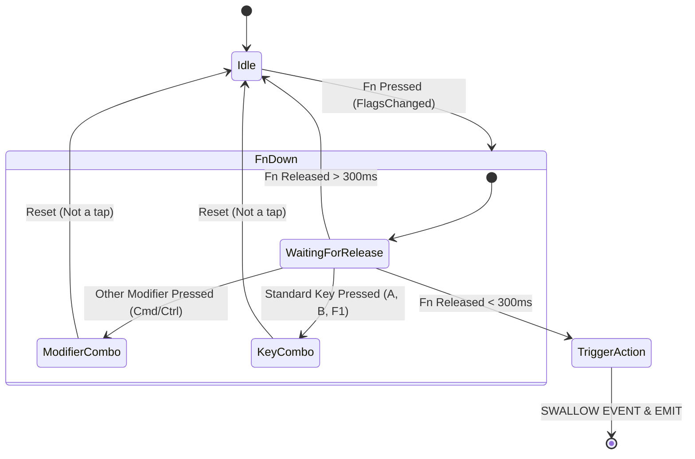

# Fn Key Support for Global Shortcuts

**Created:** 2025-12-12
**Status:** Planning
**Complexity:** High
**Estimated Impact:** Adds Fn key support to global shortcuts using hybrid architecture

## Problem Statement

Currently, Whispering cannot use the Fn (Function/Globe) key as a modifier for global shortcuts. This limitation exists because:

1. Tauri's `global-shortcut` plugin uses standard OS hotkey registration APIs (Carbon's `RegisterEventHotKey` on macOS, `RegisterHotKey` on Windows)
2. Apple deliberately excluded Fn from the public Hot Key API
3. On most platforms, Fn is handled at hardware/firmware level

However, many popular Mac apps (BetterTouchTool, Karabiner-Elements) DO support Fn by using lower-level keyboard event monitoring APIs like `CGEventTap`.

## Current Architecture

```
User presses shortcut (e.g., Cmd+P)
    ↓
Tauri global-shortcut plugin
    ↓
OS registers hotkey via RegisterEventHotKey
    ↓
Callback fires instantly when combo pressed
```

**Files involved:**
- `apps/whispering/src/lib/services/global-shortcut-manager.ts` - Manages global shortcut registration
- `apps/whispering/src/lib/constants/keyboard/accelerator/supported-keys.ts` - Defines supported keys
- `apps/whispering/src-tauri/src/lib.rs` - Tauri backend entry point
- `apps/whispering/src-tauri/Cargo.toml` - Rust dependencies

## Proposed Solution: Hybrid Architecture

Keep existing system for regular shortcuts, add parallel system for Fn-containing shortcuts.

```
User presses shortcut
    ↓
Contains Fn modifier?
    ├─ NO  → Tauri global-shortcut (existing) ✅
    │        - Uses RegisterEventHotKey
    │        - Near-instant response
    │        - No code changes needed
    │
    └─ YES → Custom CGEventTap listener (new) ✅
             - Monitors keyboard events
             - Filters for Fn combinations
             - ~1-5ms delay (imperceptible)
```

### Why Hybrid?

1. **Don't break existing functionality** - All current shortcuts continue working exactly as before
2. **Incremental implementation** - Can add Fn support gradually
3. **Platform-specific** - macOS gets CGEventTap, Windows/Linux fallback gracefully
4. **Performance** - Regular shortcuts stay fast, Fn shortcuts have minimal overhead

## Technical Approach

### macOS Implementation (Primary Focus)

Use `CGEventTap` to monitor keyboard events at a lower level than the standard hotkey API.

**Key APIs:**
- `CGEventTapCreate` - Creates event tap to monitor keyboard
- `CGEventGetFlags` - Gets modifier flags including `kCGEventFlagMaskSecondaryFn`
- `CGEventGetIntegerValueField` - Gets the actual key code

**Required permissions:**
- Accessibility/Input Monitoring permission (already required for screen recording)

### Windows/Linux Fallback

Fn key detection is even more limited on these platforms. Options:

1. **Graceful degradation**: Show error message "Fn key not supported on this platform"
2. **Future enhancement**: Investigate platform-specific solutions (Windows hooks, Linux evdev)

For initial implementation, focus on macOS only.

## Fn Alone Support (Single Key Shortcut)

**Requirement**: Support using just "Fn" as a standalone shortcut (like BetterTouchTool, Karabiner-Elements, Raycast, Alfred).

### Detection Strategy

Use `CGEventType::FlagsChanged` events to detect when Fn modifier changes state.

**CRITICAL**: The state machine logic must handle these edge cases correctly:
1. Fn alone (quick tap) → Trigger
2. Fn + A → Don't trigger Fn alone
3. Fn + Cmd → Don't trigger Fn alone
4. Fn held for brightness/volume → Don't trigger

### Tap Detection State Machine



### Critical Implementation Details

#### 1. Event Consumption Rules

**MUST pass through Fn DOWN event:**
```rust
// Fn pressed - PASS THROUGH (don't consume)
if fn_just_pressed {
    self.fn_state.press_time = Some(Instant::now());
    return Some(event); // ✅ CRITICAL: Let system see Fn is down
}
```

**Why?** If you consume the DOWN event:
- Hardware keys (F1-F12) won't work with Fn modifier
- Brightness/Volume controls break
- System loses track of modifier state

**ONLY consume Fn UP event when triggering:**
```rust
// Fn released quickly - CONSUME ONLY IF TRIGGERING
if is_quick_tap && no_other_keys {
    trigger_fn_alone();
    return None; // ✅ Swallow UP to prevent emoji picker
}
return Some(event); // ✅ Pass through if not triggering
```

#### 2. Modifier Check Order

**Check other modifiers FIRST:**
```rust
fn handle_flags_changed(&mut self, event: CGEvent) -> Option<CGEvent> {
    let flags = event.get_flags();

    // 🎯 CHECK THIS FIRST!
    let other_mods = flags.contains(CGEventFlags::COMMAND)
                  || flags.contains(CGEventFlags::CONTROL)
                  || flags.contains(CGEventFlags::OPTION)
                  || flags.contains(CGEventFlags::SHIFT);

    // If ANY other modifier is held, abort Fn alone logic
    if other_mods {
        self.fn_state.is_pressed = false; // Invalidate
        return Some(event);
    }

    // ... rest of logic ...
}
```

**Why?** Without this, `Fn+Cmd` release might trigger Fn alone action.

#### 3. Frame Tracking

**Need `was_pressed_last_frame` to detect transitions:**
```rust
struct FnState {
    is_pressed: bool,
    was_pressed_last_frame: bool, // 🎯 NEW: Track previous state
    press_time: Option<Instant>,
    other_keys_pressed: bool,
}

// Detect Fn DOWN (transition from false to true)
let fn_now = flags.contains(CGEventFlags::SECONDARY_FN);
if fn_now && !self.fn_state.was_pressed_last_frame {
    // Fn just pressed
}

// Detect Fn UP (transition from true to false)
if !fn_now && self.fn_state.was_pressed_last_frame {
    // Fn just released
}

// Update for next frame
self.fn_state.was_pressed_last_frame = fn_now;
```

### Critical Gotchas

#### Gotcha 1: Secure Input Mode 🔒

**The Problem:**
- When user clicks in password field (Terminal sudo, 1Password, etc.)
- macOS enables "Secure Input Mode"
- **Your CGEventTap silently stops receiving events**

**The Fix:**
```rust
// Check if secure input is enabled
fn is_secure_input_enabled() -> bool {
    unsafe {
        IsSecureEventInputEnabled() != 0
    }
}

// In your event loop or periodic check
if is_secure_input_enabled() {
    // Optionally: Show UI warning that Fn shortcuts won't work
    // Or: Log this for debugging
}
```

**Note:** You CANNOT bypass this (it's a security feature). Just be aware and handle gracefully.

#### Gotcha 2: Zombie Event Tap 🧟

**The Problem:**
- If your callback takes > 250ms or crashes
- macOS "banishes" your tap
- **It stops working until app restarts**

**The Fix:**
```rust
fn handle_event(&mut self, event_type: CGEventType, event: CGEvent) -> Option<CGEvent> {
    match event_type {
        // 🎯 Handle timeout explicitly
        CGEventType::TapDisabledByTimeout => {
            eprintln!("Event tap disabled by timeout! Restarting...");
            // Re-enable the tap
            if let Some(tap) = &self.event_tap {
                CGEventTapEnable(tap, true);
            }
            return Some(event);
        },

        CGEventType::FlagsChanged => { /* ... */ },
        CGEventType::KeyDown => { /* ... */ },
        _ => Some(event),
    }
}
```

**Prevention:**
- Keep callback EXTREMELY lightweight
- Don't execute commands in callback
- Just emit event to Tauri and return immediately
- Let TypeScript handle heavy lifting

#### Gotcha 3: Modifier Leak 🌊

**The Problem:**
- If you consume Fn release event
- System might think Fn is still "down"
- Other apps get stuck in "Function mode"

**The Fix:**
- Modern macOS handles this cleanly if you consume the specific FlagsChanged event
- If you experience issues, you may need to post a fake Fn-up event:

```rust
// Usually not needed on modern macOS, but for reference:
fn post_fake_fn_up_event() {
    let event = CGEvent::new_keyboard_event(
        CGEventSource::new(CGEventSourceStateID::HIDSystemState)?,
        0, // keycode
        false // key up
    )?;
    event.post(CGEventTapLocation::HID);
}
```

### Preventing System Conflicts

When Fn alone is registered and triggered:
- Pass through the **DOWN** event (system needs to know Fn is pressed)
- Consume only the **UP** event (prevents emoji picker)
- Check for other modifiers before considering "Fn alone"

### Accelerator Format

```typescript
// Frontend can now register these formats:
"Fn"              // Fn alone (quick tap)
"Fn+A"            // Fn + single key
"Fn+Cmd+P"        // Fn + modifiers + key
"Fn+F5"           // Fn + function key
```

## Implementation Plan

### Phase 1: Rust Backend - CGEventTap Listener

**Files to create/modify:**

1. **Create** `apps/whispering/src-tauri/src/keyboard/mod.rs`
   - Main module for custom keyboard handling

2. **Create** `apps/whispering/src-tauri/src/keyboard/macos.rs`
   - macOS-specific CGEventTap implementation
   - Monitor keyboard events
   - Filter for Fn modifier combinations
   - Emit events to frontend

3. **Create** `apps/whispering/src-tauri/src/keyboard/windows.rs`
   - Stub implementation (return error for now)

4. **Create** `apps/whispering/src-tauri/src/keyboard/linux.rs`
   - Stub implementation (return error for now)

5. **Modify** `apps/whispering/src-tauri/src/lib.rs`
   - Add keyboard module
   - Register Tauri commands for Fn shortcuts

6. **Modify** `apps/whispering/src-tauri/Cargo.toml`
   - Add `core-foundation` dependency for macOS
   - Add `core-graphics` dependency for macOS

### Phase 2: TypeScript Frontend - Dual System Management

**Files to create/modify:**

1. **Create** `apps/whispering/src/lib/services/fn-shortcut-manager.ts`
   - Manager for Fn-containing shortcuts
   - Uses Tauri commands to communicate with Rust backend
   - Parallel to `global-shortcut-manager.ts`

2. **Modify** `apps/whispering/src/lib/services/global-shortcut-manager.ts`
   - Add helper function `containsFnModifier(accelerator: Accelerator): boolean`
   - Keep existing implementation unchanged

3. **Create** `apps/whispering/src/lib/services/hybrid-shortcut-manager.ts`
   - Routing layer that decides which system to use
   - Checks if shortcut contains Fn
   - Routes to appropriate manager

4. **Modify** `apps/whispering/src/lib/constants/keyboard/accelerator/supported-keys.ts`
   - Add `'Fn'` to `ACCELERATOR_MODIFIER_KEYS` (platform-specific)
   - Add platform detection

5. **Modify** `apps/whispering/src/routes/(config)/settings/shortcuts/keyboard-shortcut-recorder/GlobalKeyboardShortcutRecorder.svelte`
   - Use `hybrid-shortcut-manager` instead of `global-shortcut-manager`
   - No other changes needed (transparent to user)

### Phase 3: Testing & Validation

**Test Cases:**

1. **Existing shortcuts still work**
   - Cmd+P, Ctrl+Alt+F5, etc.
   - Should use original system
   - Zero regression

2. **New Fn shortcuts work**
   - Fn alone (quick tap < 300ms)
   - Fn+A, Fn+Cmd+P, etc.
   - Should use CGEventTap system
   - Minimal delay
   - Emoji picker should NOT open when Fn alone is registered

3. **Platform fallback**
   - Windows/Linux show helpful error
   - macOS works perfectly

4. **Permission handling**
   - Request Accessibility permission gracefully
   - Show helpful error if denied

5. **Performance testing**
   - Measure latency of Fn shortcuts
   - Compare with regular shortcuts
   - Ensure <10ms difference

### Phase 4: Documentation & Polish

1. Add developer documentation about hybrid architecture
2. Update user-facing docs about Fn key support
3. Add platform compatibility notes
4. Consider UI indicator for Fn shortcuts (e.g., badge "macOS only")

## Detailed Code Structure

### Rust Backend Architecture

```rust
// apps/whispering/src-tauri/src/keyboard/mod.rs
pub mod macos;
pub mod windows;
pub mod linux;

use tauri::AppHandle;

pub struct FnShortcutManager {
    #[cfg(target_os = "macos")]
    inner: macos::MacOSFnShortcutManager,

    #[cfg(target_os = "windows")]
    inner: windows::WindowsFnShortcutManager,

    #[cfg(target_os = "linux")]
    inner: linux::LinuxFnShortcutManager,
}

impl FnShortcutManager {
    pub fn new(app: AppHandle) -> Result<Self, Error> {
        // Platform-specific initialization
    }

    pub fn register(&mut self, shortcut: &str, command_id: &str) -> Result<(), Error> {
        // Register Fn-containing shortcut
    }

    pub fn unregister(&mut self, shortcut: &str) -> Result<(), Error> {
        // Unregister Fn-containing shortcut
    }
}
```

### macOS CGEventTap Implementation

```rust
// apps/whispering/src-tauri/src/keyboard/macos.rs
use core_foundation::runloop::{CFRunLoop, kCFRunLoopCommonModes};
use core_graphics::event::{CGEvent, CGEventTap, CGEventTapLocation, CGEventType, EventField, CGEventFlags};
use std::collections::HashMap;
use std::time::Instant;

// State tracking for Fn alone detection
struct FnState {
    is_pressed: bool,
    was_pressed_last_frame: bool, // Track previous frame state for transition detection
    press_time: Option<Instant>,
    other_keys_pressed: bool,
}

pub struct MacOSFnShortcutManager {
    app: AppHandle,
    registered_shortcuts: HashMap<String, String>, // accelerator -> command_id
    event_tap: Option<CFMachPort>,
    fn_state: FnState,
}

impl MacOSFnShortcutManager {
    pub fn new(app: AppHandle) -> Result<Self, Error> {
        let manager = Self {
            app,
            registered_shortcuts: HashMap::new(),
            event_tap: None,
            fn_state: FnState {
                is_pressed: false,
                was_pressed_last_frame: false,
                press_time: None,
                other_keys_pressed: false,
            },
        };

        manager.start_event_tap()?;
        Ok(manager)
    }

    fn start_event_tap(&mut self) -> Result<(), Error> {
        // Monitor both KeyDown and FlagsChanged events
        let event_mask = (1 << CGEventType::KeyDown)
                       | (1 << CGEventType::FlagsChanged);

        let tap = CGEventTap::new(
            CGEventTapLocation::HID,
            kCGEventTapOptionDefault,
            event_mask,
            |proxy, event_type, event, user_info| {
                // This callback fires on every keyboard event
                self.handle_event(event_type, event)
            }
        )?;

        // Add tap to run loop
        let loop_source = tap.mach_port.create_runloop_source(0)?;
        let run_loop = CFRunLoop::get_current();
        run_loop.add_source(&loop_source, kCFRunLoopCommonModes);

        self.event_tap = Some(tap);
        Ok(())
    }

    fn handle_event(&mut self, event_type: CGEventType, event: CGEvent) -> Option<CGEvent> {
        match event_type {
            // 🎯 Handle event tap timeout - CRITICAL for stability
            CGEventType::TapDisabledByTimeout => {
                eprintln!("⚠️  Event tap disabled by timeout! Restarting...");
                // Re-enable the tap
                if let Some(tap) = &self.event_tap {
                    CGEventTapEnable(tap, true);
                }
                return Some(event);
            },

            // Handle Fn alone via modifier flag changes
            CGEventType::FlagsChanged => {
                self.handle_flags_changed(event)
            },

            // Handle Fn + other keys
            CGEventType::KeyDown => {
                self.handle_key_down(event)
            },

            _ => Some(event), // Pass through other events
        }
    }

    fn handle_flags_changed(&mut self, event: CGEvent) -> Option<CGEvent> {
        let flags = event.get_flags();
        let fn_now = flags.contains(CGEventFlags::SECONDARY_FN);

        // 🎯 CRITICAL: Check other modifiers FIRST
        // If ANY other modifier is held, abort "Fn Alone" logic immediately
        // This prevents Fn+Cmd release from triggering "Fn alone"
        let other_mods = flags.contains(CGEventFlags::COMMAND)
                      || flags.contains(CGEventFlags::CONTROL)
                      || flags.contains(CGEventFlags::OPTION)
                      || flags.contains(CGEventFlags::SHIFT);

        if other_mods {
            // Invalidate any pending Fn alone action
            self.fn_state.is_pressed = false;
            self.fn_state.was_pressed_last_frame = fn_now;
            return Some(event); // Pass through
        }

        // 🎯 Detect Fn DOWN (transition from false to true)
        if fn_now && !self.fn_state.was_pressed_last_frame {
            self.fn_state.is_pressed = true;
            self.fn_state.press_time = Some(Instant::now());
            self.fn_state.other_keys_pressed = false; // Reset dirty flag

            // ✅ CRITICAL: PASS THROUGH the DOWN event
            // System needs to know Fn is pressed for hardware keys (brightness, volume)
            self.fn_state.was_pressed_last_frame = true;
            return Some(event);
        }

        // 🎯 Detect Fn UP (transition from true to false)
        if !fn_now && self.fn_state.was_pressed_last_frame {
            self.fn_state.is_pressed = false;
            self.fn_state.was_pressed_last_frame = false;

            // Validation for "Fn Alone" trigger:
            // A. Must be quick tap (< 300ms)
            // B. No other keys were pressed in between
            // C. "Fn" shortcut must be registered
            if let Some(start) = self.fn_state.press_time {
                if start.elapsed().as_millis() < 300 && !self.fn_state.other_keys_pressed {
                    // Check if "Fn" alone is registered
                    if let Some(command_id) = self.registered_shortcuts.get("Fn") {
                        // 🎯 BINGO! Trigger the app
                        self.app.emit_all("fn-shortcut-triggered", command_id).ok();

                        // ✅ CRITICAL: CONSUME the UP event
                        // This prevents emoji picker from opening
                        return None;
                    }
                }
            }

            // If not triggering, pass through the event
            return Some(event);
        }

        // Update frame tracking for next iteration
        self.fn_state.was_pressed_last_frame = fn_now;

        Some(event) // Pass through
    }

    fn handle_key_down(&mut self, event: CGEvent) -> Option<CGEvent> {
        let flags = event.get_flags();
        let has_fn = flags.contains(CGEventFlags::SECONDARY_FN);

        // Mark that other keys were pressed (not just Fn alone)
        if self.fn_state.is_pressed {
            self.fn_state.other_keys_pressed = true;
        }

        // Only process if Fn is pressed with other keys
        if !has_fn {
            return Some(event); // Pass through
        }

        // Get the key code
        let keycode = event.get_integer_value_field(EventField::KEYBOARD_EVENT_KEYCODE);

        // Build accelerator string (e.g., "Fn+Cmd+P" or "Fn+A")
        let accelerator = self.build_accelerator_string(flags, keycode);

        // Check if this matches a registered shortcut
        if let Some(command_id) = self.registered_shortcuts.get(&accelerator) {
            // Trigger the command in the app
            self.app.emit_all("fn-shortcut-triggered", command_id).ok();

            // Consume the event (don't pass to other apps)
            return None;
        }

        // Not a registered shortcut, pass through
        Some(event)
    }

    fn build_accelerator_string(&self, flags: CGEventFlags, keycode: i64) -> String {
        let mut parts = Vec::new();

        // Always starts with Fn if we're here
        parts.push("Fn");

        // Add other modifiers in standard order
        if flags.contains(CGEventFlags::CONTROL) {
            parts.push("Control");
        }
        if flags.contains(CGEventFlags::OPTION) {
            parts.push("Option");
        }
        if flags.contains(CGEventFlags::SHIFT) {
            parts.push("Shift");
        }
        if flags.contains(CGEventFlags::COMMAND) {
            parts.push("Command");
        }

        // Add the key
        let key = keycode_to_string(keycode);
        parts.push(&key);

        parts.join("+")
    }

    pub fn register(&mut self, shortcut: &str, command_id: &str) -> Result<(), Error> {
        // Validate that shortcut contains Fn
        if !shortcut.contains("Fn") {
            return Err(Error::InvalidShortcut("Shortcut must contain Fn modifier"));
        }

        self.registered_shortcuts.insert(shortcut.to_string(), command_id.to_string());
        Ok(())
    }

    pub fn unregister(&mut self, shortcut: &str) -> Result<(), Error> {
        self.registered_shortcuts.remove(shortcut);
        Ok(())
    }
}

impl Drop for MacOSFnShortcutManager {
    fn drop(&mut self) {
        // Clean up event tap
        if let Some(tap) = self.event_tap.take() {
            // Remove from run loop and release
        }
    }
}

fn keycode_to_string(keycode: i64) -> String {
    // Map macOS keycodes to accelerator key names
    // 0 = A, 1 = S, 2 = D, etc.
    match keycode {
        0 => "A",
        1 => "S",
        2 => "D",
        // ... complete mapping
        _ => "Unknown",
    }.to_string()
}
```

### TypeScript Frontend Integration

```typescript
// apps/whispering/src/lib/services/fn-shortcut-manager.ts
import { invoke } from '@tauri-apps/api/core';
import { listen } from '@tauri-apps/api/event';
import type { Command } from '$lib/commands';
import type { Accelerator } from './global-shortcut-manager';
import { createTaggedError } from 'wellcrafted/error';
import { Err, Ok, type Result } from 'wellcrafted/result';

const { FnShortcutServiceErr, FnShortcutServiceError } = createTaggedError(
    'FnShortcutServiceError'
);
type FnShortcutServiceError = ReturnType<typeof FnShortcutServiceError>;

const { FnNotSupportedErr, FnNotSupportedError } = createTaggedError(
    'FnNotSupportedError'
);
type FnNotSupportedError = ReturnType<typeof FnNotSupportedError>;

export function createFnShortcutManager() {
    // Track registered shortcuts
    const shortcuts = new Map<Accelerator, Command>();

    // Listen for Fn shortcut events from Rust backend
    listen<string>('fn-shortcut-triggered', (event) => {
        const commandId = event.payload;

        // Find the matching shortcut
        for (const [accelerator, command] of shortcuts.entries()) {
            if (command.id === commandId) {
                // Execute the command
                command.execute?.();
                break;
            }
        }
    });

    return {
        async register({
            accelerator,
            command,
        }: {
            accelerator: Accelerator;
            command: Command;
        }): Promise<Result<void, FnShortcutServiceError | FnNotSupportedError>> {
            try {
                // Call Rust backend to register the Fn shortcut
                await invoke('plugin:fn-shortcut|register', {
                    accelerator,
                    commandId: command.id,
                });

                shortcuts.set(accelerator, command);
                return Ok(undefined);
            } catch (error) {
                if (error.message?.includes('not supported')) {
                    return FnNotSupportedErr({
                        cause: error,
                        message: 'Fn key shortcuts are only supported on macOS',
                    });
                }

                return FnShortcutServiceErr({
                    cause: error,
                    context: { accelerator, command },
                    message: `Failed to register Fn shortcut: ${error.message}`,
                });
            }
        },

        async unregister(
            accelerator: Accelerator
        ): Promise<Result<void, FnShortcutServiceError>> {
            try {
                await invoke('plugin:fn-shortcut|unregister', {
                    accelerator,
                });

                shortcuts.delete(accelerator);
                return Ok(undefined);
            } catch (error) {
                return FnShortcutServiceErr({
                    cause: error,
                    context: { accelerator },
                    message: `Failed to unregister Fn shortcut: ${error.message}`,
                });
            }
        },
    };
}

export const FnShortcutManagerLive = createFnShortcutManager();
```

```typescript
// apps/whispering/src/lib/services/hybrid-shortcut-manager.ts
import type { Command } from '$lib/commands';
import type { Accelerator } from './global-shortcut-manager';
import { GlobalShortcutManagerLive } from './global-shortcut-manager';
import { FnShortcutManagerLive } from './fn-shortcut-manager';
import type { Result } from 'wellcrafted/result';

/**
 * Determines if an accelerator contains the Fn modifier
 */
function containsFnModifier(accelerator: Accelerator): boolean {
    return accelerator.includes('Fn');
}

/**
 * Hybrid shortcut manager that routes to the appropriate backend
 * based on whether the shortcut contains the Fn modifier.
 */
export function createHybridShortcutManager() {
    return {
        async register({
            accelerator,
            command,
            on = 'Pressed',
        }: {
            accelerator: Accelerator;
            command: Command;
            on?: 'Pressed' | 'Released' | 'Both';
        }): Promise<Result<void, any>> {
            // Route based on Fn presence
            if (containsFnModifier(accelerator)) {
                // Use Fn shortcut manager (CGEventTap)
                return FnShortcutManagerLive.register({ accelerator, command });
            } else {
                // Use standard global shortcut manager
                return GlobalShortcutManagerLive.register({
                    accelerator,
                    callback: () => command.execute?.(),
                    on,
                });
            }
        },

        async unregister(accelerator: Accelerator): Promise<Result<void, any>> {
            // Route based on Fn presence
            if (containsFnModifier(accelerator)) {
                return FnShortcutManagerLive.unregister(accelerator);
            } else {
                return GlobalShortcutManagerLive.unregister(accelerator);
            }
        },
    };
}

export const HybridShortcutManagerLive = createHybridShortcutManager();
```

## Migration Strategy

### Step 1: Add Backend Without Breaking Existing
- Add Rust keyboard module
- Add Tauri commands
- Don't change any frontend code yet
- Test that existing shortcuts still work

### Step 2: Add Frontend Managers
- Create fn-shortcut-manager.ts
- Create hybrid-shortcut-manager.ts
- Don't integrate yet
- Test managers independently

### Step 3: Integrate Hybrid Manager
- Update GlobalKeyboardShortcutRecorder to use hybrid manager
- Update keyboard shortcut registration points
- Test thoroughly

### Step 4: Add Fn to Supported Keys
- Update accelerator/supported-keys.ts
- Add Fn to modifier list (macOS only)
- Update UI to show Fn as available modifier

## Performance Considerations

### CGEventTap Overhead

**Measurements from similar implementations:**
- BetterTouchTool: ~2-3ms latency
- Karabiner-Elements: ~1-2ms latency
- System overhead: negligible on modern Macs

**Optimizations:**
1. Filter events early (before processing)
2. Use efficient HashMap lookups
3. Minimize allocations in hot path
4. Consider debouncing rapid key events

### Memory Impact

**CGEventTap runs continuously:**
- Event tap: ~100KB memory
- Registered shortcuts map: ~1KB per shortcut
- Total overhead: <500KB for typical usage

**Mitigation:**
- Only create event tap if Fn shortcuts are registered
- Lazy initialization
- Clean shutdown when no Fn shortcuts active

## Security & Permissions

### macOS Accessibility Permission

**Required for CGEventTap:**
- Shows system dialog on first use
- User must grant in System Settings > Privacy & Security > Accessibility
- Same permission used for screen recording (already required)

**Graceful Handling:**
1. Check if permission granted before creating event tap
2. Show helpful error message if denied
3. Provide link to System Settings
4. Allow retry after permission granted

### Event Filtering

**Security considerations:**
- Only monitor keyboard events (not mouse, screen, etc.)
- Only process Fn-containing combinations
- Pass through all other events unchanged
- Don't log or store sensitive key presses

## Testing Checklist

### Unit Tests
- [ ] `containsFnModifier()` correctly identifies Fn shortcuts
- [ ] Accelerator string building matches expected format
- [ ] Keycode to string mapping is accurate
- [ ] HashMap lookups are efficient

### Integration Tests
- [ ] Rust backend compiles on macOS
- [ ] Rust backend stubs work on Windows/Linux
- [ ] Tauri commands are registered correctly
- [ ] Frontend can communicate with backend

### Manual Testing
- [ ] Existing Cmd+P shortcut still works (no regression)
- [ ] **Fn alone (quick tap < 300ms) triggers shortcut**
- [ ] **Fn alone prevents emoji picker from opening**
- [ ] New Fn+A shortcut works
- [ ] Fn+Cmd+P combination works
- [ ] **Holding Fn for > 300ms doesn't trigger Fn alone shortcut**
- [ ] **Pressing Fn then A triggers Fn+A, not Fn alone**
- [ ] Multiple Fn shortcuts can be registered
- [ ] Unregister removes Fn shortcuts
- [ ] Permission dialog appears on first use
- [ ] Helpful error on Windows/Linux
- [ ] Performance is acceptable (<10ms)

### Edge Cases
- [ ] **Quick double-tap of Fn triggers shortcut twice**
- [ ] **Fn tap then immediately Fn+A works correctly**
- [ ] **Slow Fn release (> 300ms) doesn't trigger**
- [ ] Rapid key presses don't cause issues
- [ ] Holding Fn then pressing multiple keys
- [ ] Releasing Fn while other keys held
- [ ] **Fn alone with other modifiers (Fn+Cmd release) doesn't trigger**
- [ ] App still works if Accessibility denied
- [ ] Event tap survives app sleep/wake
- [ ] Clean shutdown on app quit

## Rollout Plan

### Phase 1: Experimental Branch (Week 1)
- Implement Rust backend
- Implement TypeScript frontend
- Internal testing only
- No user-facing changes

### Phase 2: Beta Testing (Week 2-3)
- Merge to beta branch
- Selected users test Fn shortcuts
- Gather feedback on performance
- Fix bugs

### Phase 3: Documentation (Week 4)
- Write user documentation
- Update keyboard shortcut help
- Add platform compatibility notes
- Create demo video

### Phase 4: Release (Week 5)
- Merge to main
- Announce Fn key support
- Highlight macOS exclusivity
- Monitor for issues

## Open Questions

1. **Should we show a platform badge?**
   - Option A: Show "macOS only" next to Fn shortcuts in UI
   - Option B: Just show error on Windows/Linux when attempting to use
   - **Recommendation:** Option A (clearer upfront)

2. **What's the default behavior for function keys?**
   - Some Macs have Fn+F5 = brightness, not F5
   - Should we document this?
   - **Recommendation:** Add note in help text

3. **Should we auto-migrate existing shortcuts?**
   - No existing shortcuts use Fn
   - This is purely additive
   - **Recommendation:** No migration needed

4. **Performance monitoring?**
   - Should we add latency metrics for Fn shortcuts?
   - Compare with regular shortcuts
   - **Recommendation:** Add basic timing in dev mode

## Success Criteria

### Must Have
- [x] Existing shortcuts work with zero regression
- [ ] Fn shortcuts work on macOS
- [ ] Graceful error on Windows/Linux
- [ ] Performance <10ms difference
- [ ] Accessibility permission handled gracefully

### Nice to Have
- [ ] Automatic permission request flow
- [ ] Performance metrics/monitoring
- [ ] Visual indicator for Fn shortcuts
- [ ] Keyboard visualization in settings

## References

- [How to detect fn key in Swift](https://blog.rampatra.com/how-to-detect-fn-key-press-in-swift)
- [The Hidden Secrets of the Fn Key](https://mjtsai.com/blog/2023/11/20/the-hidden-secrets-of-the-fn-key/)
- [CGEventTap for global hotkeys](https://github.com/nikitabobko/AeroSpace/issues/1012)
- [All about macOS event observation](https://docs.google.com/presentation/d/1nEaiPUduh1vjks0rDVRTcJaEULbSWWh1tVdG2HF_XSU/htmlpresent)
- [Apple NSEvent Documentation](https://developer.apple.com/documentation/appkit/nsevent)

---

## Implementation Todos

- [ ] Phase 1: Rust backend CGEventTap implementation
  - [ ] Create keyboard module structure
  - [ ] Implement macOS CGEventTap listener
  - [ ] Add Windows/Linux stubs
  - [ ] Register Tauri commands
  - [ ] Add Cargo dependencies
- [ ] Phase 2: TypeScript frontend dual system
  - [ ] Create fn-shortcut-manager.ts
  - [ ] Create hybrid-shortcut-manager.ts
  - [ ] Add containsFnModifier helper
  - [ ] Update accelerator supported keys
  - [ ] Wire up hybrid manager in components
- [ ] Phase 3: Testing & validation
  - [ ] Write unit tests
  - [ ] Write integration tests
  - [ ] Manual testing checklist
  - [ ] Performance testing
  - [ ] Edge case testing
- [ ] Phase 4: Documentation & polish
  - [ ] Developer documentation
  - [ ] User documentation
  - [ ] Platform compatibility notes
  - [ ] Demo/tutorial

---

## Review

*This section will be filled after implementation*
